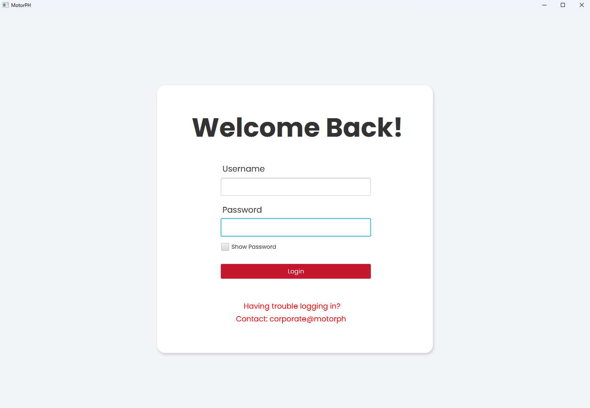
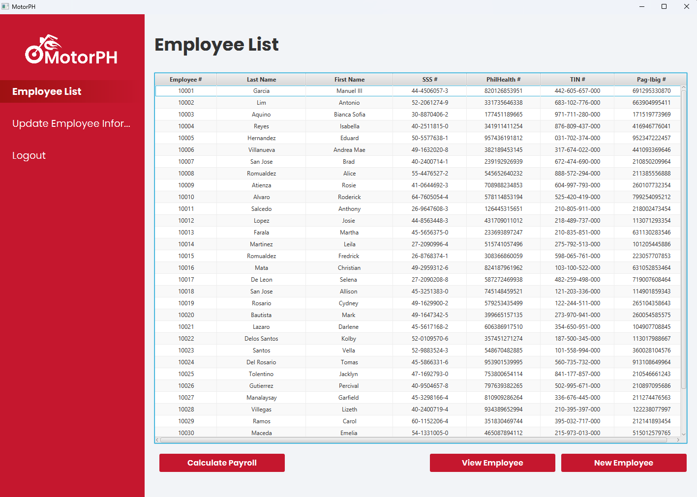
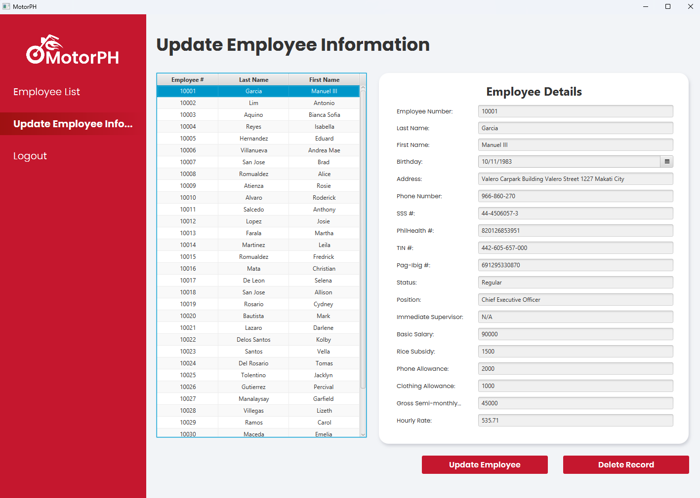

# MotorPH Employee Management Payroll System
## MO-IT103 Computer Programming 2 | A1101

This is the final version of the MotorPH Payroll System, developed as part of our terminal assessment for MO-IT103. The application is designed to manage employee records and payroll for MotorPH.

## Group 2 Members:
- Cherry Angiela Ishizuka
- Joy Faye Pacite
- Psalm Delos Reyes
- Liam Cody Sumadsad
- Thriastan Jeanne Bosing

## Project Description
The MotorPH Employee Management Payroll System is a Java-based desktop application built using JavaFX and FXML. It features a user-friendly interface for HR staff to securely manage employee records and calculate payroll.

### Key Features:
- User login and authentication
- Add, view, update, and delete employee records
- Automatic validation and error handling
- Real-time salary and payslip computation
- Confirmation prompts for safer actions

## Technologies Used
- Java
- JavaFX
- FXML
- IntelliJ IDEA

## Login Information
To access the system, use the following credentials:

- **Username:** admin
- **Password:** password

## Status
Project Completed - Final version submitted for terminal assessment.

---

## Screenshots

### Figure 1: Login Screen
This is the application's welcome screen. Users must log in with valid credentials to access the dashboard. 

---

### Figure 2: Employee List Dashboard
After logging in, users are directed to the Employee List dashboard. This view provides access to employee data and actions like Add, View, and Generate Payslip.

---

### Figure 3: Update Employee Information
This screen allows HR staff to update existing employee information with validation checks before saving.

